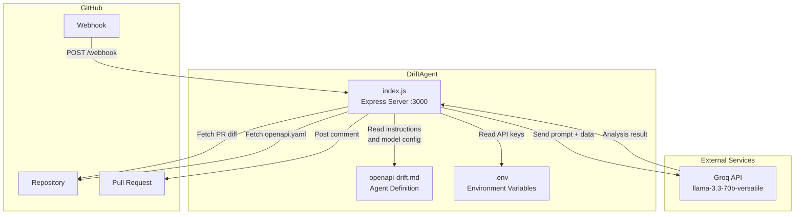
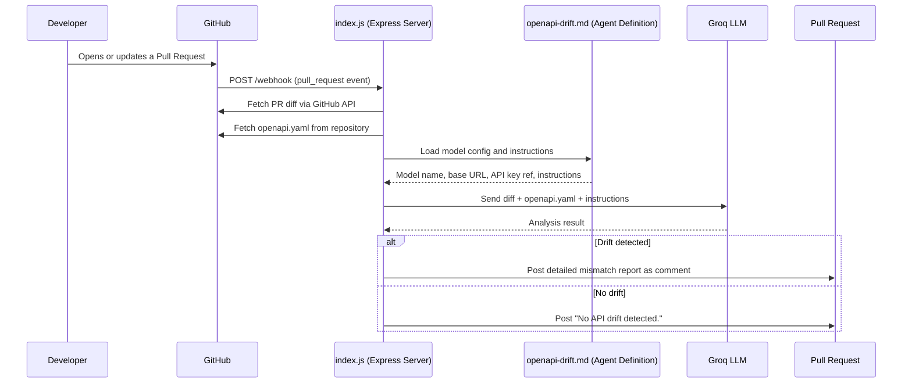
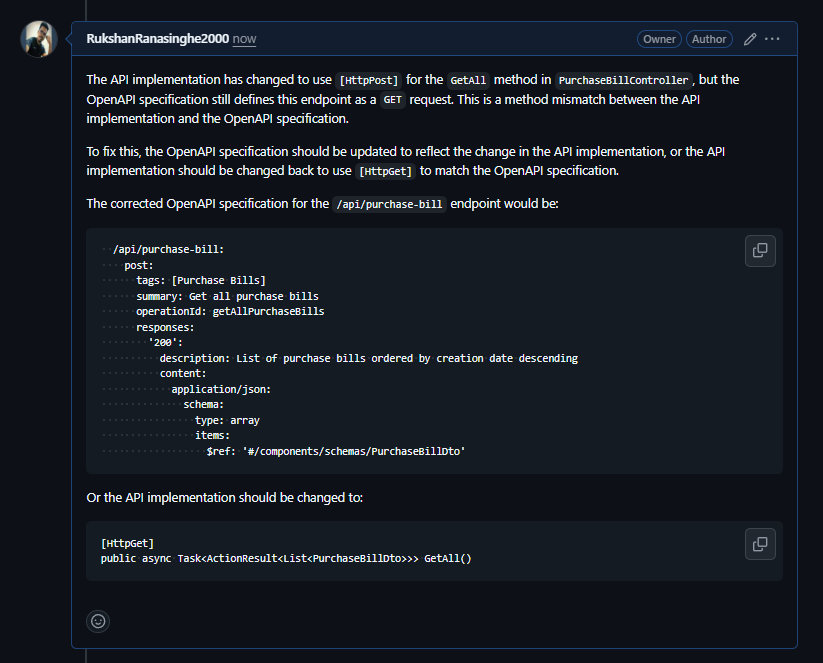
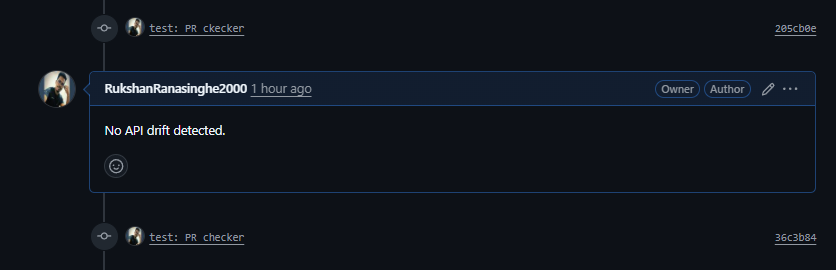

# OpenAPI Drift Checker

An AI-powered agent that automatically detects drift between your API implementation and OpenAPI specification on every pull request. When a PR is opened or updated, the agent analyzes the diff against your `openapi.yaml` and posts a review comment with any mismatches found.

## Component Diagram




## How It Works



1. GitHub sends a webhook event when a PR is opened, reopened, or synchronized.
2. The agent fetches the PR diff and the `openapi.yaml` file from the repository.
3. The diff is analyzed by an LLM (via Groq) using the instructions defined in `src/agents/openapi-drift.md`.
4. The result is posted as a comment on the PR.

## Prerequisites

- Node.js v18 or higher
- A Groq API key (https://console.groq.com)
- A GitHub personal access token
- A publicly accessible URL for the webhook (e.g. via ngrok for local development)

## Setup

### 1. Clone and install dependencies

```bash
git clone <repo-url>
cd DriftAgent
npm install
```

### 2. Configure environment variables

Create a `.env` file in the project root:

```env
GROQ_API_KEY=your_groq_api_key_here
GITHUB_TOKEN=your_github_token_here
```

Note: This project uses Groq by default. If you want to use a different provider or model, update the `model` section in `src/agents/openapi-drift.md` and adjust the environment variable name accordingly. No changes to `index.js` are needed.

### 3. Start the server

```bash
node src/index.js
```

The server runs on port 3000 by default.

## GitHub Token Permissions

When creating a GitHub personal access token, the following permissions are required:

- Pull requests: Read and Write (to read PR data and post review comments)
- Issues: Read and Write (to post comments on PRs via the issues API)
- Contents: Read (to fetch the openapi.yaml file from the repository)

To create a fine-grained token:

1. Go to GitHub Settings > Developer settings > Personal access tokens > Fine-grained tokens.
2. Click "Generate new token".
3. Under "Repository access", select the repositories this agent should monitor.
4. Under "Permissions", set the access levels listed above.
5. Copy the generated token into your `.env` file.

## Setting Up the GitHub Webhook

1. Go to your GitHub repository.
2. Navigate to Settings > Webhooks > Add webhook.
3. Set the Payload URL to your server's public URL followed by `/webhook`:
   ```
   https://your-domain.com/webhook
   ```
   For local development using ngrok:
   ```bash
   ngrok http 3000
   ```
   Then use the ngrok HTTPS URL as the Payload URL.
4. Set Content type to `application/json`.
5. Under "Which events would you like to trigger this webhook?", select "Let me select individual events" and check "Pull requests".
6. Make sure "Active" is checked.
7. Click "Add webhook".

Once configured, the agent will automatically run on every new or updated pull request.

## Project Structure

```
.
├── src/
│   ├── agents/
│   │   └── openapi-drift.md   # AFM agent definition (model config + instructions)
│   └── index.js               # Express server and webhook handler
├── .env                       # Environment variables (not committed)
└── package.json
```

## Agent Configuration

The agent behavior, model, and instructions are defined in `src/agents/openapi-drift.md`. The model config (name, base URL, API key reference) lives in the YAML frontmatter of that file, keeping `index.js` free of hardcoded model settings.

To switch models, update the `model.name` field in the frontmatter. Any model available on Groq can be used.

### Advantages of openapi-drift.md (Agent)

Keeping the agent definition in a separate markdown file rather than inside application code has several practical benefits:

- Single source of truth. All agent-related configuration — model, provider, base URL, authentication, and instructions — lives in one place. You never need to dig through application code to understand what the agent does or how it is configured.

- No code changes to update behavior. Changing the agent's instructions, switching to a different model, or pointing to a different provider only requires editing the markdown file. The application code in `index.js` does not need to be touched.

- Readable by non-developers. The instructions section is plain English markdown, making it easy for anyone on the team to review, understand, and suggest changes to the agent's logic without needing to read JavaScript.

- Version controlled and auditable. Because the agent definition is a standalone file, changes to agent behavior are clearly visible in git diffs, separate from infrastructure or application logic changes.

- Portable. The AFM format is designed to be framework-agnostic. The same `openapi-drift.md` file can be picked up by any AFM-compatible runner, making it easy to migrate or reuse the agent in a different runtime or platform.

## References

- WSO2 Agent Flavored Markdown - Pull Request Analyzer Example: https://wso2.github.io/agent-flavored-markdown/examples/pull_request_analyzer/

## License

MIT License. See [LICENSE](./LICENSE) for details.

## Demo

### Drift detected:



### No issues found:


